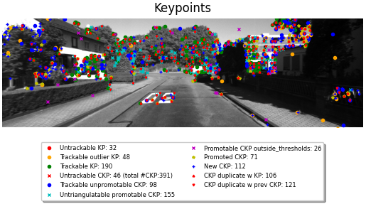
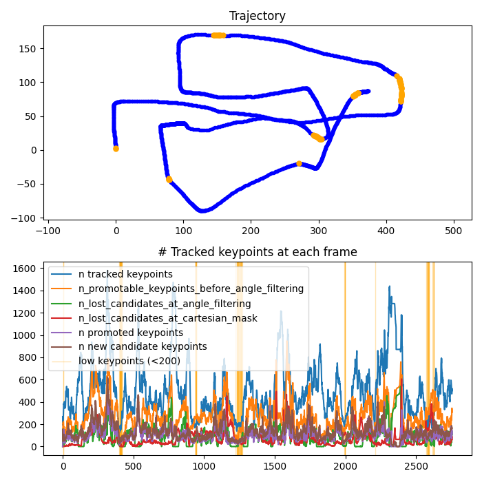

# Monocular Visual Odometry Pipeline
This repository contains the implementation of a monocular visual odometry pipeline. 
First, an initial set of 2D-3D correspondences is extracted from the first frames of each dataset.
Then, the camera pose is estimated from the subsequent frames.
Whenever possible, available OpenCV implementations of the algorithms are used for maximum efficiency.

We achieved acceptable local accuracy on the datasets.
However, our implementation suffers from global scale ambiguity which is expected due to the monocular setup.
We could mitigate some drift by tuning the parameters but to achieve better results on a global scale, more parameter tuning would be necessary.
In addition, further optimization techniques such as Bundle Adjustment or Pose-Graph Optimization, as well as Place Recognition for loop detection and closure would be required to receive more reliable global results.

The program was developed from scratch as part of the course *Vision Algorithms for Mobile Robots* at UZH, taught by Prof. Scaramuzza.

<p align="center">
    
    
</p>

## Screencasts:
These are the links to the screencasts recorded for each of the datasets:

- KITTI: [Kitti](https://youtu.be/iMiLZzel61M)
- Malaga: [Malaga](https://youtu.be/ksQePvSiVzQ)
- Parking: [Parking](https://youtu.be/6iXwq24SfQY)

## Specifications of the machine used to record the screencasts
The machine on which we recorded the screencasts was an ASUS Zenbook 14 OLED with the following specifications:
- Intel Evo i9 CPU
- 32 GB RAM
- NVidia GeForce RTX onboard graphics
- Runnning Ubuntu 22.04

The metrics while running the KITTI pipeline were the following, as seen in this screencast of the System Monitor taken while the pipeline was running:
[Kitti System Monitor](https://youtu.be/w8Ba_fKGgv0)

## Putting the datasets in the right place
You can download the datasets from the [Robot Perception Group](#https://rpg.ifi.uzh.ch/teaching.html) website.

From the base directory of this repository, the images of the datasets should be inside the following folder structure:

### KITTI:
```bash
data/kitti/05/image_0/
```
### Malaga:
```bash
data/malaga/malaga-urban-dataset-extract-07_rectified_800x600_Images/
```
### Parking:
```bash
data/parking/images/
```

You can select the desired dataset inside the code as described further down.

## Running the pipeline
To run the pipeline, create a virtual environment with the requirements.txt file and make sure that you correctly place the datasets.
Then run the main.py file.
This executes the entire pipeline and creates the intermediate plots as well as the final metric plot.

To run the pipeline with conda, perform the following steps:

1. Navigate to the base directory of the repo (where this readme is also located) and install the anaconda environment from the provided environment.yml file:
```bash
conda env create -f environment.yml
```

2. Activate the conda environment:
```bash
conda activate VAMR_Project
```

3. Then run the following command:
```bash
python3 main.py
```

The dataset can be selected by changing the dataset integer in line 26 of the main.py file:
```bash
...
# Setup
dataset = 0 # 0: KITTI, 1: Malaga, 2: parking, 3: test <---- select desired dataset here
...
```